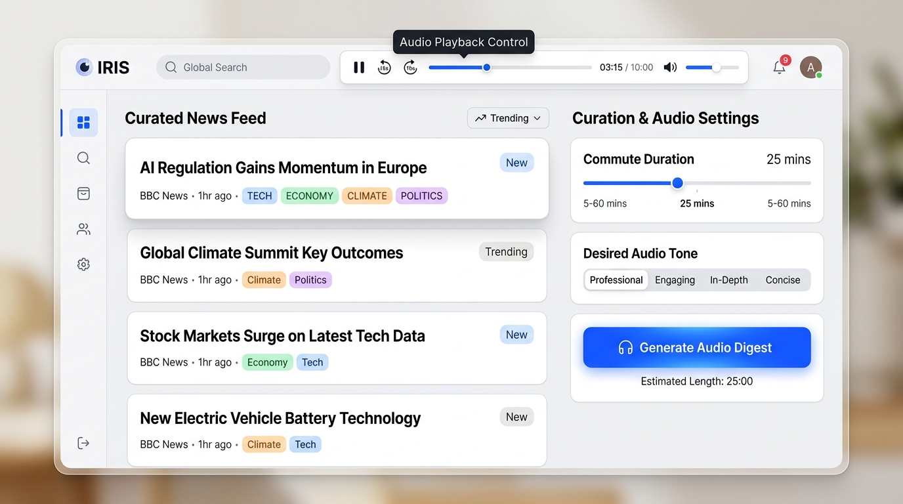
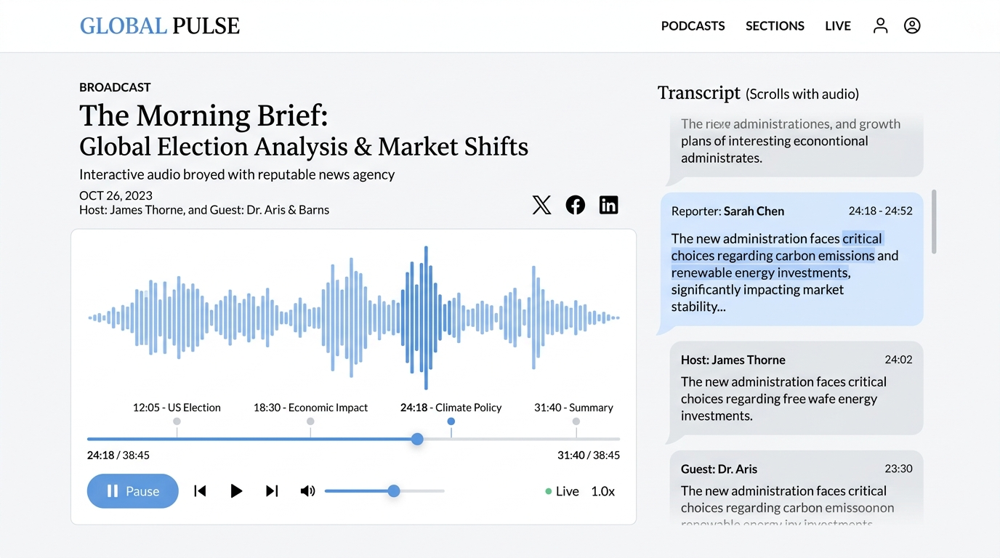
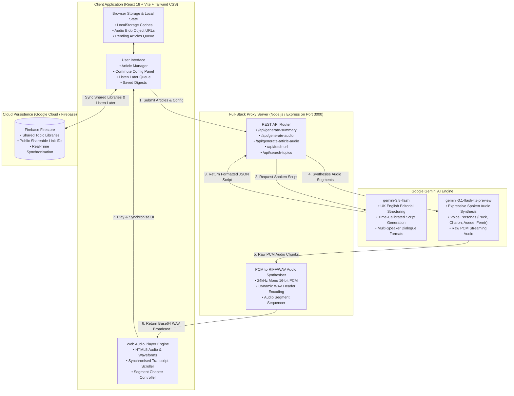

# Iris — Commute Audio Briefings

> Inspired by the Greek messenger goddess of swift dispatches: personalised, broadcast-ready audio news briefings tailored for your daily commute with Gemini AI.



Iris transforms your morning or evening commute into a curated radio newsroom. Instead of scanning endless headlines or listening to generic podcasts that don't match your travel duration, Iris calibrates your curated reading list to the exact length of your journey, synthesising an articulate, multi-story spoken broadcast with natural British English delivery.

---

## 📸 Interface Showcase

### 1. Curated Newsroom & Personalisation Studio
Manage articles, filter by beat (Tech, Climate, Economy, Science), customise commute durations from 5 to 45 minutes, select broadcast formats (Solo Host or Co-Hosted Duo), and choose voices.


### 2. Studio Audio Player & Synchronised Transcript
Listen to studio-grade broadcasts with scrubbing controls, segment chapter markers, and interactive transcripts that jump playback directly to the corresponding story when clicked.



---

## 🏛️ System Architecture

Iris uses a decoupled, full-stack architecture combining a high-performance React SPA with a Node.js/Express server that acts as a secure proxy to Google Gemini models and Firebase Firestore.

### Mermaid Flowchart



### Architectural Data Flow (ASCII Diagram)

```
+-----------------------------------------------------------------------------------+
|                                CLIENT BROWSER (SPA)                              |
|                                                                                   |
|  [Article Manager] <---> [Commute Controls] <---> [Audio Player & Transcript]     |
|         |                        |                             ^                  |
|         v                        v                             |                  |
+---------+------------------------+-----------------------------+------------------+
          |                                                      |
          | POST /api/generate-summary                           | Playback Data:
          | Payload: { articles, commuteMinutes, tone, voices }  | WAV Audio + Timings
          v                                                      |
+----------------------------------------------------------------+------------------+
|                            EXPRESS BACKEND (server.ts)                            |
|                                                                                   |
|  1. /api/generate-summary                                                         |
|     --> Dispatches prompt to Gemini 3.8 Flash                                     |
|     --> Generates UK English time-calibrated broadcast script                     |
|                                                                                   |
|  2. /api/generate-audio                                                           |
|     --> Calls Gemini 3.1 Flash TTS preview per story segment                      |
|     --> Receives raw 24kHz 16-bit mono PCM chunks                                 |
|     --> Prepends canonical 44-byte RIFF/WAV header                                |
|     --> Returns base64 Data URL array to client for seamless playback             |
+--------------------------+------------------------------+-------------------------+
                           |                              |
                           v                              v
            +------------------------------+  +-------------------------------+
            |    Google Gemini AI SDK      |  |       Firebase Firestore      |
            |                              |  |                               |
            |  * gemini-3.8-flash          |  |  * Shared Topic Collections   |
            |  * gemini-3.1-flash-tts      |  |  * Commute Configurations     |
            |    (Aoede, Puck, Charon)     |  |  * Saved Digests History      |
            +------------------------------+  +-------------------------------+
```

---

## ✨ Key Capabilities

1. **Precision Commute Calibration (5–45 minutes)**
   - Automatically budgets spoken word count (~130–150 words per minute) to fit your train or motorway journey.
   - Adjusts depth from concise rapid-fire bullet briefs to deep analytical discussions.

2. **Studio Audio & Natural Spoken Delivery**
   - Powered by `gemini-3.1-flash-tts-preview`.
   - Supports **Solo Host** or **Co-Hosted Duo** formats with natural banter and fluid transitions.
   - Distinctive voice personas: *Puck* (engaging lead), *Charon* (deep analyst), *Aoede* (warm narrative), *Fenrir* (authoritative).

3. **British English Localisation (en-GB)**
   - Complete UK English spelling throughout interface copy, notifications, and AI broadcast prompts.
   - BBC-style news production cadence and transport terminology (*motorway*, *tube*, *rail corridor*).

4. **Listen Later Queue**
   - Individual story queue for listening to standalone articles on demand.
   - In-memory audio caching to prevent redundant syntheses.

5. **Cloud Sharing via Firebase Firestore**
   - Generate instant shareable URLs (`?share=...`) for curated reading lists.
   - One-click import into other commuters' studios.

6. **Backup & Portability**
   - One-click JSON backup export for saved article collections.
   - Instant paste or file upload import.

---

## 🛠️ Technology Stack

| Layer | Technology | Purpose |
|---|---|---|
| **Frontend Framework** | React 18 + Vite | Component lifecycle and fast compilation |
| **Styling & Layout** | Tailwind CSS | Editorial aesthetic, custom scrollbars, responsive design |
| **Icons & Visuals** | Lucide React | Clean, scalable vector iconography |
| **Server / Proxy** | Express.js + TSX | Type-safe backend proxy preventing API key exposure |
| **AI Text Engine** | Google Gemini 3.8 Flash (`@google/genai`) | News distillation, story sequencing, UK script crafting |
| **AI Spoken Engine** | Google Gemini 3.1 Flash TTS Preview | Expressive voice synthesis and raw audio generation |
| **Database & Sync** | Firebase Firestore | Durable cross-device storage for shared libraries |

---

## 🚀 Getting Started

### Prerequisites
- Node.js 18+ or Bun
- A valid Google Gemini API Key (`GEMINI_API_KEY`)

### Environment Setup
Create a `.env` file in the root directory:

```env
GEMINI_API_KEY=your_gemini_api_key_here
PORT=3000
```

### Installation & Execution

```bash
# Install dependencies
npm install

# Start development server
npm run dev

# Build for production
npm run build

# Start production server
npm start
```

The application will be accessible at `http://localhost:3000`.

---

## 📡 API Reference

| Endpoint | Method | Description |
|---|---|---|
| `/api/health` | `GET` | Health check verifying server and Gemini API configuration |
| `/api/generate-summary` | `POST` | Generates a time-budgeted, multi-segment broadcast script |
| `/api/generate-audio` | `POST` | Converts broadcast script segments into 24kHz RIFF/WAV audio |
| `/api/generate-article-audio` | `POST` | Generates on-demand spoken audio for a single article |
| `/api/fetch-url` | `POST` | Extracts title, text, and metadata from web articles |
| `/api/search-topics` | `POST` | Discovers recent news articles for a user-specified topic |
| `/api/trending-topics` | `GET` | Returns trending commute news beats |

---

## 📄 Licence

Released under the MIT Licence. Built with Google AI Studio.
